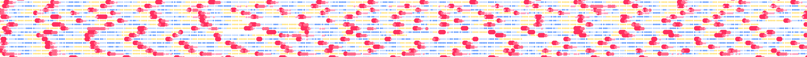

# Pre-print
The current version of the paper can be downloaded on [bioRxiv](https://www.biorxiv.org/content/10.1101/385054v1)

# Peer-reviewed published version
Coming soon

# Figures, Code and Data

Code and aggregated data to reproduce the figures can be found on the github repo [FAM](LINK)

# Contact
Any question or request can be addressed at Laura Symul 

[lsymul@stanford.edu](mailto:lsymul@stanford.edu) 

[laurasymul@gmail.com](mailto:laurasymul@gmail.com) 

[lsy.works](http://lsy.works/)

[twitter](https://twitter.com/LauraSymul) @LauraSymul

